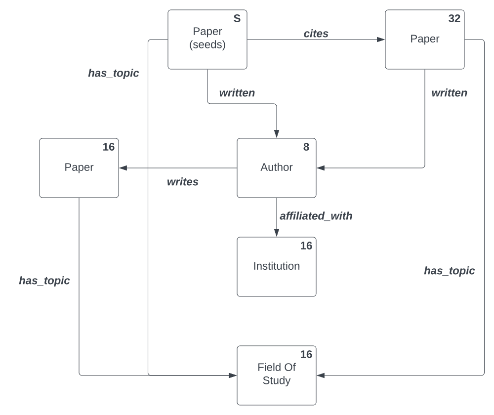

# Data Preparation and Sampling

## Introduction

The `tensorflow_gnn` library supports reading streams of `tf.train.Example`
proto messages with all the contents of a graph, or subgraph, encoded in them.
This document describes how to produce such a stream of encoded data using the
library helper functions, details of the encoding (if you’d like to write your
own graph data generator), and showcases a scalable sampling tool based on
Apache Beam that we provide to sample from very large graphs.

## Writing Graph Tensors to Files

If you use Python, the most straightforward method to produce streams of
[`GraphTensor`](./graph_tensor.md) instances to files is to

1.  Create eager instances of `GraphTensor`
2.  Call `tensorflow_gnn.write_example()`
3.  You serialize the `tf.train.Example` message to a file.

Instances of `GraphTensor` can be arbitrarily created. For example, to write out
a stream of 1000 randomly generated `Example` protos to a `TFRecords` file, you
can use this code:

```
import tensorflow_gnn as tfgnn

schema = tfgnn.read_schema(schema_filename)
with tf.io.TFRecordWriter(record_file) as writer:
  for _ in range(1000):
    graph = tfgnn.random_graph_tensor_from_schema(schema)
    example = tfgnn.write_example(graph)
    writer.write(example.SerializeToString())
```

In order to scale this up to large graphs, you need to write some code that

*   Iterates through the subset of nodes around which you will train a model.
*   Samples a subset of nodes of interest in its neighborhood
*   Creates an instance of `GraphTensor` to write out (as above).

We recommend utilizing a framework based on the Map-Reduce conceptual framework
in order to run this at scale. Apache Beam provides a portable abstraction for
writing jobs that will run on a variety of platforms, clusters and clouds.

## Encoding Graph Tensors

There are a variety of graph data formats in existence and your application data
may even live on an in-house data warehousing server. This means that in many
cases you will end up having to write your own sampler and produce the sampled
data format directly instead of
using the sampling tools
and converters we provide. The
sampled data is encoded as a set of `tf.train.Feature` objects within a
`tf.train.Example` protocol buffer (protocol buffer messages are efficient
compact binary containers for your training data). For more information about
these, see the
[TensorFlow documentation](https://www.tensorflow.org/api_docs/python/tf/train/Example).

If the encoding is carried out in Python (e.g. from an Apache Beam job), you
should be able to create an instance of an eager GraphTensor in memory (e.g.
using the `GraphTensor.from_pieces()` method) and use the
[`tfgnn.write_example()`](../api_docs/python/tfgnn/write_example.md)
function to encode it to a `tf.train.Example`. However,
if this is not done in Python, you will have to write your own encoder.

Fortunately, this is not difficult. This section describes in detail the
encoding of graph tensors that you will need to carry out your data production.

### Feature Names

A `GraphTensor` instance contains a hierarchy of tensors. Each of those are
named after their location in the `GraphTensor`, with the following
`tf.train.Feature` names in a `tf.train.Example` proto:

```
context/<feature_name>
nodes/<set_name>.<feature_name>
edges/<set_name>.<feature_name>
```

`<set_name>` is the name of the node set or edge set. These should correspond
directly to the features declared in the [`GraphSchema`](./schema.md) message.

### Special Features

Three of the features are implicitly defined:

*   **Size features.** These features provide the number of nodes in a set.
    These are important and should always appear if a set is not empty, because
    it is possible for node sets to have no feature data but only aggregate
    features from incoming edges. We call these “latent nodes.” Size features
    are always of type `tf.int64` and are encoded as the following
    `tf.train.Feature` name:

    ```
    nodes/<set_name>.#size
    ```

    or

    ```
    edges/<set_name>.#size
    ```

*   **Source and Target Indices**. These features provide the edge indices for
    each endpoint of a binary edge. The features are always of type `tf.int64`
    and are encoded as

    ```
    edges/<set_name>.#source
    ```

    and

    ```
    edges/<set_name>.#target
    ```

    Recall that the notion of "source" and "target" captures the direction
    of an edge in the graph (as a data structure), but does not prescribe
    which way a GNN model can send information along the edge.

Note: Serialization for hyper-adjacency — edges with more than two endpoints —
is not currently supported, and when support for it is added, some modifications
may occur on these names.

### Encoding Dense Tensors

For dense tensors of fixed shape, the list of values for an entire set are
flattened and concatenated. This means that if you have a feature of 4 x 4
blocks of floats, for a node set with 3 nodes, that feature would have to encode
3 x 4 x 4 = 48 floats. The parser takes care to automatically reshape the
feature based on the size of the graph and the known shape for each node.

### Scalar Features

Scalar features differ from tensors of shape `[1]` in the resulting container.
However, when encoded, since all we provide is a flattened list of all the data,
encodings for scalar features and features of rank 1 with one value are
identical. The parser takes care to reshape the features as expected upon
reading them.

### Encoding Ragged Tensors

Features with some dimensions of variable size require you to provide the shape
of each value for those dimensions. For example, for a feature of the following
declared shape:

```
shape { dim { size: -1 }
dtype: DT_INT64
```

for a node set with 3 nodes, an example of this feature might have the following
value:

```
[[10, 15, 23],
 [89],
 [64, 53, 25, 29]]
```

This would be encoded like this:

```
features {
  feature {
    key: "nodes/students.#size"
    value {
      int64_list {
        value: 3
      }
    }
  }
  feature {
    key: "nodes/students.scores"
    value {
      int64_list {
        value: 10
        value: 15
        value: 23
        value: 89
        value: 64
        value: 53
        value: 25
        value: 29
      }
    }
  }
  feature {
    key: "nodes/students.scores.d1"
    value {
      int64_list {
        value: 3
        value: 1
        value: 4
      }
    }
  }
}
```

The values `[3, 1, 4]` refer to the number of items in each row. Notice how
those sizes—the ragged dimension—are provided as a feature with a special name:

```
edges/<set_name>.d<dim>
```

where `<dim>` is the index of the ragged dimension. In the example, the shape of
that unbatched tensor will be `[3, None]`, and the ragged dimension is at index
1 (starting from 0), so we store it as `<feature-name>.d1`. The feature values
are provided as a single flat list of the `flat_values` of the corresponding
ragged tensor. Note that if you have multiple dimensions, you would encode each
of the ragged dimensions as its own feature. And for context features, do take
into account the fact that the shape includes an initial `[1]` dimension.

Finally, note that our parser is a thin wrapper onto the regular TensorFlow
feature specs for parsing ragged tensors::
[tf.io.RaggedFeature](https://www.tensorflow.org/api_docs/python/tf/io/RaggedFeature)
. If you’re familiar with those, you can generate the parsing spec using our
`tfgnn.get_io_spec()` utility function.

### Empty Features

Features that have no values can either be omitted or present but with empty
lists of values. The former would be encoded like this:

```
features {
  feature {
    key: "nodes/students.#size"
    value {
      int64_list {
        value: 3
      }
    }
  }
}
```

This is also a valid encoding for the same tensor of 3 empty rows:

```
features {
  feature {
    key: "nodes/students.#size"
    value {
      int64_list {
        value: 3
      }
    }
  }
  feature {
    key: "nodes/students.scores"
    value {
      bytes_list {
      }
    }
  }
  feature {
    key: "nodes/students.scores.d1"
    value {
      int64_list {
      }
    }
  }
}
```

### Empty Sets

Declared sets that happen to have no nodes can simply be omitted and will be
created as empty tensors. For example:

```
ex = tf.train.Example()
gt2 = tfgnn.parse_single_example(spec, tf.constant(ex.SerializeToString()))
print(gt2.node_sets['students']['scores'])
print(gt2.node_sets['students'].sizes)
<tf.RaggedTensor []>
tf.Tensor([0], shape=(1,), dtype=int32)
```

Alternatively, you can explicitly encode a zero tensor for the sizes. For
example, this would also work:

```
ex = tf.train.Example()
ex.features.feature['nodes/students.#size'].int64_list.value.append(0)
gt2 = tfgnn.parse_single_example(spec, tf.constant(ex.SerializeToString()))
```

### Generating Example Encodings

In order to understand the encoding format, it may be additionally helpful to
poke around and print encodings for a particular spec or graph schema. You may
do this by inspecting randomly generated data fitting a schema as follows:

```
import tensorflow_gnn as tfgnn
schema = tfgnn.parse_schema("""
  node_sets {
    key: "students"
    value {
      features {
        key: "scores"
        value {
          shape { dim { size: 3 }}
          dtype: DT_FLOAT
        }
      }
    }
  }
""")
spec = tfgnn.create_graph_spec_from_schema_pb(schema)
gt = tfgnn.random_graph_tensor(spec)
print(tfgnn.write_example(gt))
```

You might get:

```
features {
  feature {
    key: "nodes/students.#size"
    value {
      int64_list {
        value: 4
      }
    }
  }
  feature {
    key: "nodes/students.scores"
    value {
      float_list {
        value: 0.2121654748916626
        value: 0.5609347820281982
        value: 0.4877915382385254
        value: 0.1555272340774536
        value: 0.2997016906738281
        value: 0.8022844791412354
        value: 0.033922433853149414
        value: 0.3420950174331665
        value: 0.7682920694351196
        value: 0.49579453468322754
        value: 0.03295755386352539
        value: 0.4508802890777588
      }
    }
  }
}
```

And for a ragged feature:

```
schema = tfgnn.parse_schema("""
  node_sets {
    key: "students"
    value {
      features {
        key: "scores"
        value {
          shape { dim { size: -1 }}
          dtype: DT_STRING
        }
      }
    }
  }
""")
spec = tfgnn.create_graph_spec_from_schema_pb(schema)
gt = tfgnn.random_graph_tensor(spec)
print(tfgnn.write_example(gt))
```

You might get:

```
You might get:
features {
  feature {
    key: "nodes/students.#size"
    value {
      int64_list {
        value: 4
      }
    }
  }
  feature {
    key: "nodes/students.scores"
    value {
      bytes_list {
        value: "S"
        value: "L"
        value: "Z"
        value: "M"
        value: "A"
        value: "X"
        value: "Z"
        value: "W"
        value: "E"
        value: "I"
        value: "J"
        value: "K"
        value: "L"
        value: "K"
        value: "Z"
        value: "M"
      }
    }
  }
  feature {
    key: "nodes/students.scores.d1"
    value {
      int64_list {
        value: 6
        value: 5
        value: 2
        value: 3
      }
    }
  }
}
```

If you have a specific tensor value you’d like to test out, you can also create
a specific `GraphTensor` value and encode it like this:

```
rt = tf.ragged.constant(
  [[10, 15, 23],
   [89],
   [64, 53, 25, 29]])

gt = tfgnn.GraphTensor.from_pieces(
    node_sets={
        'object': tfgnn.NodeSet.from_fields(
          sizes=[3],
          features={'counts': rt}
    )})

tfgnn.write_example(gt)
```

## Graph Sampling

The library comes with a sampler written in Apache Beam that can produce encoded
`tf.train.Example` proto messages in sharded output files. This is the format we
produce for training datasets from data preparation jobs.

### Input Graph Format

The graph sampler accepts graphs in a simple data format we call “unigraph.”
This data format supports very large, homogeneous and heterogeneous graphs with
variable number of node sets and edge sets. In order to use the graph sampler
tool we provide, you need to convert your graph in the unigraph format.

A unigraph dataset is defined by a central text-formatted protocol buffer
message that describes the topology of the graph using the same `GraphSchema`
message used for graph tensors (but describing the full, unsampled graph).
For each context, node set and edge set, there is an associated “table” of ids
and features. Each table can be one of many supported formats, such as a CSV
file, sharded files of serialized `tf.train.Example` protos in a TFRecords
container, and more. The filename associated with each set’s table is provided
as metadata in the `filename` field of its metadata and can be a local name.
Typically, a schema and all the tables live under the same directory, which is
dedicated to that graph’s data.

Any sets of features can be defined on these tables; requirements on the table
files are minimal:

*   Node sets are required to provide a special **id** string column to identify
    the node row.
*   Edge sets are required to provide two special string columns: **source** and
    **target**, defining the origin and destination of the edge. Edge rows may
    also contain features, such as weight (or anything else).
*   Context sets have no special requirement, this is for a table of data
    applying to the entire graph (and rarely used).

This format is kept as simple and flexible on purpose. See `unigraph.py` in the
source code for an Apache Beam reader library that can be used to read those
files and process them.

### Sampler Configuration

The sampler is configured by providing three files:

*   **A graph, in unigraph format.** This is specified by providing the path to
    the text-formatted
    [`GraphSchema` protocol buffer file](https://github.com/tensorflow/gnn/blob/main/tensorflow_gnn/proto/graph_schema.proto),
    or the directory containing it and the graph’s data tables. This file has to
    include `filename` fields to existing files.
*   **A sampling specification.** This is a text-formatted
    [`sampling_spec.proto:SamplingSpec`](https://github.com/tensorflow/gnn/blob/main/tensorflow_gnn/sampler/sampling_spec.proto)
    proto file that defines how sampling will be performed. For example, you can
    specify how many sampling steps to run and which sampling strategy to use at
    each hop. For full details on the sampling specification, see the proto file
    for instructions. There is also an example below.
*   **The seed node ids to sampler.** An (optional) input file with a list of
    nodes of interest at which to seed the sampling. This defines the points
    where the sampler will gather a neighborhood for training, testing and/or
    inference. This file can be in any of the supported `Universal Graph Format`
    table formats. If this is not provided, very node specified in the `seed_op`
    node set will be used as a sampling seed.

Upon completion, the sampler will output files with **serialized
[`GraphTensor`](https://github.com/tensorflow/gnn/blob/main/tensorflow_gnn/graph/graph_tensor.py#:~:text=class%20GraphTensor)
instances as
[`tf.train.Example`](https://www.tensorflow.org/api_docs/python/tf/train/Example)
protos**. These can then be read using the `tfgnn.parse_example()` function
mapping over a stream of these protos provided by a
[`tf.data.Dataset`](https://www.tensorflow.org/api_docs/python/tf/data/Dataset),
as is customary in TensorFlow.

### End-to-End Heterogeneous Graph Sampling: OGBN-MAG

#### The OGBN-MAG Dataset

The following is an example of sampling over the
[OBGN-MAG](https://ogb.stanford.edu/docs/nodeprop/#ogbn-mag) dataset, a popular
citation network used for benchmarking a node prediction task; classifying a
label associated with certain nodes in the network. In the case of OGBN-MAG a
node prediction challenge would be to predict the venue (journal or conference)
that a paper in a held-out test set is published at. The node and edge sets for
the OBGN-MAG dataset are as follows:

##### Node Sets

*   "paper" contains 736,389 published academic papers, each with a
    128-dimensional word2vec feature vector computed by averaging the embeddings
    of the words in its title and abstract.
*   "field_of_study" contains 59,965 fields of study, with no associated
    features.
*   "author" contains the 1,134,649 distinct authors of the papers, with no
    associated features
*   "institution" contains 8740 institutions listed as affiliations of authors,
    with no associated features.

##### Edge Sets:

*   "cites" contains 5,416,217 edges from papers to the papers they cite.
*   "has_topic" contains 7,505,078 edges from papers to their zero or more
    fields of study.
*   "writes" contains 7,145,660 edges from authors to the papers that list them
    as authors.
*   "affiliated_with" contains 1,043,998 edges from authors to the zero or more
    institutions that have been listed as their affiliation(s) on any paper.

The graph schema file defines the topology of the full graph by enumerating the
node (entity) and edge (relationship) types, the features each entry contains
and the location of the tables that represent the graph:

```
node_sets {
  key: "author"
  value {
    features {
      key: "#id"
      value {
        dtype: DT_STRING
      }
    }
    metadata {
      filename: "nodes-author.tfrecords@15"
      cardinality: 1134649
    }
  }
}
node_sets {
  key: "field_of_study"
  value {
    features {
      key: "#id"
      value {
        dtype: DT_STRING
      }
    }
    metadata {
      filename: "nodes-field_of_study.tfrecords@2"
      cardinality: 59965
    }
  }
}
node_sets {
  key: "institution"
  value {
    features {
      key: "#id"
      value {
        dtype: DT_STRING
      }
    }
    metadata {
      filename: "nodes-institution.tfrecords"
      cardinality: 8740
    }
  }
}
node_sets {
  key: "paper"
  value {
    features {
     key: "#id"
      value {
        dtype: DT_STRING
      }
    }
    features {
      key: "feat"
      value {
        dtype: DT_FLOAT
        shape {
          dim {
            size: 128
          }
        }
      }
    }
    features {
      key: "labels"
      value {
        dtype: DT_INT64
        shape {
          dim {
            size: 1
          }
        }
      }
    }
    features {
      key: "year"
      value {
        dtype: DT_INT64
        shape {
          dim {
            size: 1
          }
        }
      }
    }
    metadata {
      filename: "nodes-paper.tfrecords@397"
      cardinality: 736389
    }
  }
}
edge_sets {
  key: "affiliated_with"
  value {
    source: "author"
    target: "institution"
    metadata {
      filename: "edges-affiliated_with.tfrecords@30"
      cardinality: 1043998
    }
  }
}
edge_sets {
  key: "cites"
  value {
    source: "paper"
    target: "paper"
    metadata {
      filename: "edges-cites.tfrecords@120"
      cardinality: 5416271
    }
  }
}
edge_sets {
  key: "has_topic"
  value {
    source: "paper"
    target: "field_of_study"
    metadata {
      filename: "edges-has_topic.tfrecords@226"
      cardinality: 7505078
    }
  }
}
edge_sets {
  key: "writes"
  value {
    source: "author"
    target: "paper"
    metadata {
      filename: "edges-writes.tfrecords@172"
      cardinality: 7145660
    }
  }
}
```

A TF-GNN modeler would craft a SamplingSpec proto configuration for a particular
task. For the OGBN-MAG venue prediction challenge,
[examples/mag/sampling_spec.pbtxt](https://github.com/tensorflow/gnn/blob/main/examples/mag/sampling_spec.pbtxt)
contains one such valid specification:

```
seed_op <
  op_name: "seed"
  node_set_name: "paper"
>
sampling_ops <
  op_name: "seed->paper"
  input_op_names: "seed"
  edge_set_name: "cites"
  sample_size: 32
  # Sample edges uniformly at random, because that works without any further
  # information. We could use TOP_K or RANDOM_WEIGHTED if we had put a
  # "#weight" column into the edge set's input table.
  strategy: RANDOM_UNIFORM
>
sampling_ops <
  op_name: "paper->author"
  input_op_names: "seed"
  input_op_names: "seed->paper"
  edge_set_name: "written"
  sample_size: 8
  strategy: RANDOM_UNIFORM
>
sampling_ops <
  op_name: "author->paper"
  input_op_names: "paper->author"
  edge_set_name: "writes"
  sample_size: 16
  strategy: RANDOM_UNIFORM
>
sampling_ops <
  op_name: "author->institution"
  input_op_names: "paper->author"
  edge_set_name: "affiliated_with"
  sample_size: 16
  strategy: RANDOM_UNIFORM
>
sampling_ops <
  op_name: "paper->field_of_study"
  input_op_names: "seed"
  input_op_names: "seed->paper"
  input_op_names: "author->paper"
  edge_set_name: "has_topic"
  sample_size: 16
  strategy: RANDOM_UNIFORM
>
```

The sampling schema may be better understood by visualizing it's operations and
graph exploration (traversal) in plate notation:

<p align=center>
  
</p>

Which specifies the following sampling procedure:

1.   Select all nodes from "paper" node set as "seeds".
2.   Sample up to 32 "cites" edges outgoing from seeds.
3.   Sample up to 8 "written" edges from each node in the seed "paper" and
     "paper" nodes drawn on the step 2.
4.   Sample up to 16 more "writes" edges for every "author" node from the
     step 3.
5.   For every "author" sample up to 16 "affiliated_with" edges.
6.   For every paper sample up to 16 "has_topic" edges.

NOTE: By default the Graph Sampler samples **edges** from the graph. This allows
to better control complexity even for dense graphs with large-degree nodes.
For some applications it is desired to include all edges from the original graph
that connect sampled nodes by setting
`--edge_aggregation_method=node`.

##### Apache Beam and Google Cloud Dataflow

The TF-GNN Graph Sampler is written in [Apache Beam](https://beam.apache.org/),
an open-source SDK for expressing
[Dataflow-Model](https://research.google/pubs/pub43864/) data processing
pipelines with support for multiple infrastructure backends.

[Google Cloud Platform (GCP)](https://cloud.google.com/) is Google's cloud
computing service and [Dataflow](https://cloud.google.com/dataflow) is GCP's
service for executing Beam pipelines at scale. The two main abstractions defined
by Apache Beam of concern are:

-   [Pipelines](https://beam.apache.org/documentation/programming-guide/#creating-a-pipeline):
    computational steps expressed as a DAG (Directed Acyclic Graph)
-   [Runners](https://beam.apache.org/documentation/runners/capability-matrix/):
    Environments for running Beam Pipelines

A client writes an Apache Beam Pipeline and, at runtime, specifies a Runner to
define the compute environment in which the pipeline will execute. The simplest
Beam runner is the
[DirectRunner](https://beam.apache.org/documentation/runners/direct/) which
executes Beam pipelines on local hardware. *Only* use the DirectRunner for small
scale development and testing. Google provides a runner implementation named
[DataflowRunner](https://beam.apache.org/documentation/runners/dataflow/) that
enables clients to connect to a GCP project and execute a Beam pipeline on GCP
hardware through the Dataflow service.

Distributed compute services like Dataflow typically follow a Manager/Worker
architecture where machines performing distributed computations need to be able
to import common definitions, libraries and serialize/deserialize data. An easy
way to ensure that all machines executing the Beam pipeline have a consistent
software environment is to provide generate a [Docker](https://www.docker.com/)
image that can be pulled by every Beam worker.

TF-GNN provides a
[Dockerfile](https://github.com/tensorflow/gnn/blob/main/Dockerfile) which can
be used to build a consistent compute environment for running TFGNN
applications. Docker images can be leveraged by machines in a GCP project by
pushing the image to
[Google Container Registry](https://cloud.google.com/container-registry) or the
[Google Artifact Registry](https://cloud.google.com/artifact-registry). Assuming
a user has a GCP project with a name stored in the environment variable
`GOOGLE_CLOUD_PROJECT` and Docker installed on their local machine, a TFGNN
image may be built from the root of the TFNN project and pushed to their
container registry with something like:

```shell
docker build . -t tfgnn:latest -t gcr.io/${GOOGLE_CLOUD_PROJECT}/tfgnn:latest
docker push gcr.io/${GOOGLE_CLOUD_PROJECT}/tfgnn:latest
```

Alternatively, the container could be built on Google Cloud with
[Google Cloud Build](https://cloud.google.com/build) and automatically be added
to the container registry without the push though the client would want to
`docker pull` the image down to their machine to execute commands within a
running container.

The graph (in unigraph format) with it's graph schema need to be hosted at a
location accessible by Dataflow workers. Likewise, the target output location
must writable by Dataflow workers. The simplest solution is to host the unigraph
in on [Google Cloud Storage (GCS)](https://cloud.google.com/storage/) and set
the output to be a sharded fileset also hosted on GCS.

A user will need credentials to connect to the appropriate GCP
project and start Dataflow jobs. Default application credentials are
sufficient for a small isolated project and running batch sampling jobs but
production environments will probably want to create custom service accounts.

Default application credentials can be acquired by running:

```shell
gcloud auth application-default login
```

After following the instructions to complete authentication, a JSON file will be
created and placed (typically) at
`~/.config/gcloud/application_default_credentials.json`.

Additionally, Docker should be installed on the host machine. Users could
potentially install python and TFGNN locally but it is easiest to use the Docker
container to instantiate the Dataflow job especially as the python version of
the job starting the Dataflow job and the version of python running the workers
must match (a Dataflow constraint). Using docker locally to start (or even to
develop) ensures the execution environment of the host exactly matches the
environment of the Dataflow worker machines.

Let the root of the local TF-GNN repo be `TFGNN` and the name of the GCP
project be represented as `GOOGLE_CLOUD_PROEJCT`. The following commands build
the TF-GNN docker image and pushes it to GCR.

```shell
cd $TFGNN_REPO
docker build . -t tfgnn:latest -t gcr.io/${GOOGLE_CLOUD_PROJECT}/tfgnn:latest
docker push gcr.io/${GOOGLE_CLOUD_PROJECT}/tfgnn:latest
```

The following will start a docker container running the `tfgnn:latest` image,
download the OGBN-MAG dataset *to the host machine*, convert it to unigraph
format and save artifacts to the host `/tmp/data/ogbn-mag/graph` folder:

```shell
[./examples/mag/download_and_format.sh](https://github.com/tensorflow/gnn/blob/main/examples/mag/download_and_format.sh)
```

The above command starts Docker container running the `tfgnn:latest` image, and
mounts the users local `/tmp` directory to `/tmp` in the container's filesystem.
The tfgnn_convert_ogb_dataset tool is run within the container which downloads
and converts the OGBN-MAG graph. At the completion of this command, the
container will be brought down but the unigraph representation of OBGN-MAG will
persist on the host machine at `/tmp/data/ogbn-mag/graph`. To move this data to
GCS, create a GCS bucket (if one doesn't already exist). Assuming
`GOOGLE_CLOUD_BUCKET` holds the desired name of the bucket:

```shell
gcloud mb gs://${GOOGLE_CLOUD_BUCKET}
```

will create the bucket and the following will copy the unigraph to GCS:

```shell
gsutil cp -m /tmp/data/ogbn-mag/graph
gs://${GOOGLE_CLOUD_BUCKET}/tfgnn/mag
```

[examples/mag/sample_dataflow.sh](https://github.com/tensorflow/gnn/blob/main/examples/mag/sample_dataflow.sh)
provides a template that a user can fill-in with appropriate values and launch
the sampling job on Dataflow. However, it is worth discussing the details of the
shell script.

```shell
MAX_NUM_WORKERS=1000

SAMPLING_SPEC="/app/examples/mag/sampling_spec.pbtxt"
GRAPH_SCHEMA="/app/examples/mag/schema.pbtxt"
TEMP_LOCATION="gs://${GOOGLE_CLOUD_BUCKET}/tmp"
OUTPUT_SAMPLES="gs://${GOOGLE_CLOUD_BUCKET}/mag-samples@100"
REGION=us-east1  # or other desired value.

# remember to build/push.
TFGNN_IMAGE="gs://${GOOGLE_CLOUD_PROJECT}/tfgnn:latest"
GCP_VPC_NAME="your-network-name"
JOB_NAME="tfgnn_mag_sampling"

docker run -v ~/.config/gcloud:/root/.config/gcloud \
  -e "GOOGLE_CLOUD_PROJECT=${GOOGLE_CLOUD_PROJECT}" \
  -e "GOOGLE_APPLICATION_CREDENTIALS=/root/.config/gcloud/application_default_credentials.json" \
 --entrypoint tfgnn_graph_sampler \
  tfgnn:latest \
  --graph_schema="${GRAPH_SCHEMA}" \
  --sampling_spec="${SAMPLING_SPEC}" \
  --output_samples="${OUTPUT_SAMPLES}" \
  --runner=DataflowRunner \
  --dataflow_service_options=enable_prime \
  --project=${GOOGLE_CLOUD_PROJECT} \
  --region=${REGION} \
  --max_num_workers="${MAX_NUM_WORKERS}" \
  --temp_location="${TEMP_LOCATION}" \
  --job_name="${JOB_NAME}" \
  --no_use_public_ips \
  --network="${GCP_VPC_NAME}" \
  --experiments=shuffle_mode=service \
  --experiments=use_monitoring_state_manager \
  --experiments=enable_execution_details_collection \
  --experiment=use_runner_v2 \
  --worker_harness_container_image=${TFGNN_IMAGE} \
  --alsologtostderr
```

The `-v ~/.config/gcloud:/root/.config/gcloud` argument injects the host's
`~/.condig/gcloud` directory into the chrooted filesystem of the spawned
container at `/root/.config/gcloud`. The `-e` arguments define environment
variables, in the context of the running container, that specify the GCP project
name and the location (again, relative to the container filesystem) of the
host's application default credentials file. `--entrypoint tfgnn_graph_sampler`
starts the main Graph Sampler binary after container startup and `tfgnn:latest`
is just the name and tag of the (local) `tfgnn` image that Docker will start.
The remaining arguments specify the location of the graph schema, sampling
specification and the target output files.

A tricky part of the command is the `--network=${GCP_VPC_NAME}`. Dataflow
workers by default allocate machines that acquire IP addresses with external
internet access. This makes sense as some users of Dataflow will want to `pip
install` additional libraries or use other mechanisms to download content to
workers. However, IPs with external internet access count against the project's
global quota which may require special permission to increase. We can define a
named [Virtual Private Cloud (VPC)](https://cloud.google.com/vpc) to allocate a
dedicated IP range that can scale to the maximum number of Dataflow workers
without counting against (or allocating) the global external IP quota. These
steps and flag are optional but are recommended.

The Graph Sampler is not limited to running on Google Cloud infrastructure, but
instructions for acquiring and injecting credentials as well as cloud-specific
command line arguments will differ from platform to platform.

### Sampling Homogeneous Graphs

The example above supports any number of node sets and is broadly general over
heterogeneous graphs. Note that this maps well to database tables with cross
references: you would write a custom job to extract the data to be sampled from
your database to Unigraph format, or write a sampler that directly accesses them
yourself.

Homogeneous graphs in this context are simply a special case of heterogeneous
graphs with a single set of nodes and a single set of edges. There is nothing
special to do to support them. OBGN-ARXIV is another popular open-source
citation network used for benchmarking but only consists of a single entity and
edge type describing the links between "papers". An example of running sampling
on the OGBN-ARXIV dataset is given in
[examples/arxiv](https://github.com/tensorflow/gnn/tree/main/examples/arxiv)
which can be run following the same procedures described in the OGBN-MAG
example.
