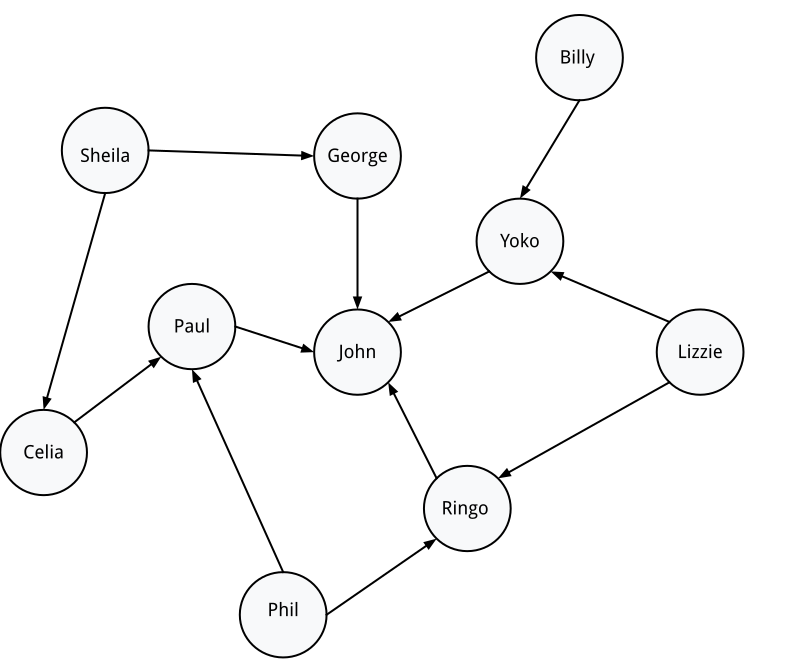
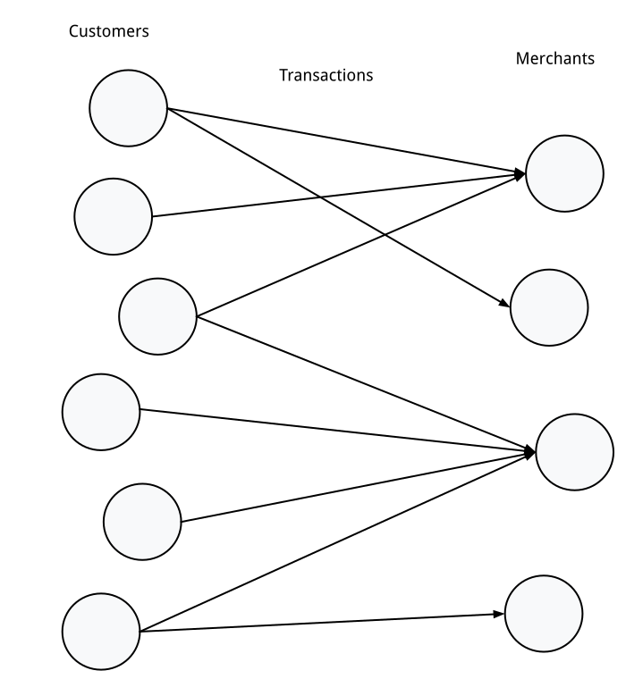

# Introduction to Graph Neural Networks

This page provides a very brief, high-level introduction to what graph neural
networks are, from the perspective of their application in practice.

## What is a Graph?

You can model very many domains of the world as entities and their
relationships. “Nodes” are used to represent various types of entities and their
relationships as links between them, or “edges”. These are also called
“networks” and there’s a vast field of research around their properties called
“network science.” For example, a historical log of transactions may involve
nodes of type “customer” and “merchant”, and edges of type “purchase”. Networks
are a very general and powerful way to model many domains.

Each of the entities can be associated with features. A customer could have a
location, a credit score, and a credit card, which itself has a history of
payments. The edges also can have feature information associated with them as
well, for instance, the amount, date, and time of day of the transaction.

## Homogeneous Graphs

Many graphs have a single type of entity and edges between them. A classic
example of this is a social network: nodes are persons and edges are their
friendship relations.

Homogeneous graphs are often used to learn summary representations that
represent the local information near and around each node. These representations
are then used as inputs to regular deep learning models.

## Heterogeneous Graph and Relational Tables

Relational models such as those found in database tables can be mapped to
graphs. Each of the tables defines a type of node, and references across the
tables can be instantiated as edges. Our previous example of, a database with a
table of customers and a table of merchants with transactions between them would
define two sets of nodes and a set of directed edges from customers to
merchants:

Heterogeneous models are general and flexible and can be applied nearly
anywhere, with a pretty straightforward mapping of real-world entities to model
structure.

## Neural Networks on Graphs: Convolutions

Graphs have been used in learning tasks for a long time. Algorithms that create
clusters of nodes on existing graphs are well-established and label propagation
algorithms that trickle information between nodes have been around for decades.
But how do we use graphs with neural networks?

The essence of the method is the graph convolution. The features of each node
are first normalized and encoded to a single tensor of floating-point numbers,
as is required at the input of a regular neural network. The node features are
then run through four stages:

1. gather: The node features are broadcast across each of the edges;
2. transform: The results are transformed by a function (possibly itself a
   neural network);
3. pooling: The results of these edge transformations are averaged and projected
   back to the nodes;
4. update: The aggregated results over the nodes are run through another neural
   network to produce updated features for each node.

This happens over all the nodes and edges, at the same time. This process can be
repeated and allows for the propagation of features, hopping over graph edges.
Every time a feature is propagated it can be transformed by a neural network or
a fixed function. The backpropagation method optimizes neural network kernels by
computing gradients over each of these hops to learn transformations that will
minimize a loss objective, in the usual way. Finally, classification and/or
regression over nodes, edges or the entire graph is possible by adding a final
head neural network to the model.

This is the basic primitive we use, in its simplest form. In practice, small
variations are used to improve model accuracy and expressivity for particular
scenarios. For example, one of the effects of running convolutions is that the
averaging of feature values over neighborhoods tends to blur the features; to
mitigate this effect, the original node features can be reintroduced at every
hop (“skip connection” models) and meld the original feature detail with the
averaged feature information from a node’s neighborhood.

## The Problem with Irregularity

Neural network libraries operate over very large tensors of floating-point
numbers, and are essentially optimized matrix-multiplication engines with
concurrent execution. Regular deep neural networks have a fixed shape and are
able to operate on fixed-size vectors in memory.

In contrast, each training example of a GNN is a graph with a different number
of nodes and edges. We have to handle the irregular number of corresponding
features. This introduces a fair amount of complexity in the representation,
library code and model API. To a large extent, this is what this library
addresses.

The data preparation tools accompanying this library are able to produce an
encoding of graphs that takes care of the irregular shapes. To represent
irregularly shaped tensors in memory, we rely on the tf.RaggedTensor class from
TensorFlow, which is designed to handle tensors with several dimensions that
vary in size, ragged dimensions. We wrap these tensors in a container of our
own, the GraphTensor, whose feature shapes are constrained to represent valid
graphs. This container provides methods to access the various parts of a graph
as tensors (node features, edge indices, edge features). The library also
provides methods to easily build convolutions on these features. Finally, the
library also supports additional constraints to run on hardware architectures
which require fixed buffer sizes (such as TPUs).

Two of the features we support in this project are often ignored in the
research: the need to encode and represent multiple features for each node
and/or edge (which is necessary for categorical features and computed
embeddings) and good support for heterogeneous models (which extends the reach
of GNNs substantially).

## Scaling Up

In practice many graphs are very large, e.g. billions of nodes. Many graphs
simply do not fit in memory. How do we train models on such graphs? The approach
adopted in this library is to sample local neighborhoods around nodes which we
want to train over, e.g., nodes with associated ground truth labels. See the
dedicated chapter ["Scaling Graph Neural Networks"](scaling.md) on the topic of
scalability in the project documentation.

## More Information and Research

In the field of research on deep learning, graph neural networks are currently
enjoying an unprecedented amount of attention and popularity. Their generality
promises a broad level of application and new techniques and variants are
appearing fast. This library intends to bridge the gap between research and
application by providing a flexible platform which also supports aspects only
required from practitioners (e.g., categorical features on nodes that allow one
to also train embeddings). Please consult the various workshops on GNNs for more
details.

Here are a few papers surveying the development of the field and the various
methods that have been published:

* Machine Learning on Graphs: A Model and Comprehensive Taxonomy
  (https://arxiv.org/pdf/2005.03675.pdf)
* Relational inductive biases, deep learning, and graph networks
  (https://arxiv.org/abs/1806.01261)
* Graph neural networks: A review of methods and applications
  (https://arxiv.org/pdf/1812.08434.pdf)
* A Survey on Heterogeneous Graph Embedding: Methods, Techniques, Applications
  and Sources (https://arxiv.org/pdf/2011.14867.pdf)
* A Comprehensive Survey on Graph Neural Networks
  (https://arxiv.org/pdf/1901.00596.pdf)
