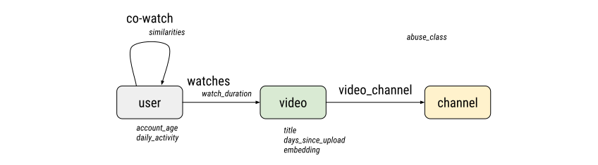

# Describing your Graph

## The graph schema

Graph neural networks (GNNs) are neural networks which take graphs as input
examples and perform trained transformations and aggregations of features
across the nodes and edges of the graph.

The TF-GNN library and its data preparation tools handle **heterogeneous
graphs**, which is to say that the nodes and edges of the graph are partitioned
into one or more disjoint node sets and edge sets, resp., that are processed
separately and can carry different features.

The **graph schema** defines:

  * The node sets of the graph, and the features for each node set.
  * The edge sets of the graph, and for each edge set its features,
    its source node set and its target node set.
  * The context features of the graph. These apply to an input graph
    as a whole, not a particular node or edge. (The schema does not support
    the case of one input broken into components with separate contexts.)

Each of the features is defined by

  * A name, unique among the features of the same graph piece.
  * A plain-text description (optional).
  * A data type: one of `DT_STRING`, `DT_INT64`, `DT_FLOAT`. These are the types
    available for serialization in a `tf.Example`.
  * A feature shape: `[]` or unset for scalars (a single number or string),
    `[size]` for vectors (e.g., a vector of 64 floats with shape `[64]`),
    and so on. The special value `-1` denotes a ragged dimension, which can
    vary between feature values (e.g., the words of an input sentence).

Note that the feature shape applies to one item (node, edge) and excludes the
prefix dimensions `[*graph_shape, (num_items), ...]` that are present in the
feature tensor held by the EdgeSet, NodeSet or Context piece of a
[`tfgnn.GraphTensor`](../api_docs/python/tfgnn/GraphTensor.md).
See the [intro to GraphTensor](graph_tensor.md) for more.

Within one node set or edge set, all items (nodes/edges) must agree in the
properties declared by the schema. (Missing input features can be made to agree
using a default value, or an empty ragged value, if needed.) Otherwise, the
node set or edge set must be broken up. When modeling real-world objects and
relations, it is recommended to use separate sets for separate types of
real-world objects.

TF-GNN stores the graph schema in a
[tfgnn.GraphSchema](https://github.com/tensorflow/gnn/blob/main/tensorflow_gnn/proto/graph_schema.proto)
protocol message.
Recall that [Protocol Buffers](https://developers.google.com/protocol-buffers)
are a language-neutral serialization format, which makes the graph schema
available both to the [tools that generate training data](data_prep.md) for GNNs
and to the TensorFlow program that [consumes this input for GNN
training](input_pipeline.md).

For example, the following declarations define that each node instance (e.g.,
"video") contains three features: a thumbnail image, a video embedding, and
the tokenized video title.

```
feature {
  key: "thumbnail_image"
  value {
    description: "Thumbnail image: 32x32 pixels of RGB values in range [0,1]."
    dtype: DT_FLOAT
    shape { dim { size: 32 } dim { size: 32 } dim { size: 3 } }
  }
}
feature {
  key: "video_embedding"
  value {
    description: "Video embeddings computed by VEmbed team."
    dtype: DT_FLOAT
    shape { dim { size: 256 } }
  }
}
feature {
  key: "video_title"
  value {
    description: "The video title, tokenized as words."
    dtype: DT_STRING
    shape { dim { size: -1 } }  # A ragged dimension.
  }
}
```

A ragged feature dimension is indicated with the special value -1 in the schema,
as can be seen in the `"video_title"` feature.

The graph schema is not intended to provide information about how to build your
model, or to specify what the loss/objective is, or even how to combine the
particular features it provides and for what purpose; those concerns are
addressed in defining the GNN model on top of the input data.

### Naming rules

The various node sets and edge sets are identified by `str`-valued keys.
Typically, these are human-readable names like `"user"` or `"video"`.
Certain special characters at the beginning of the name are reserved for
internal purposes of the TF-GNN library.

  * The hash mark `#` is reserved for internal use by `tfgnn.GraphTensor`
    and must not appear as the first character of a node set or edge set name.
  * The underscore `_` is reserved as the first character of auxiliary node sets
    or edge sets that can be stored in a GraphTensor, subject to specific rules,
    in order to encode structural information beyond the nodes and edges from
    the application domain. (The next section will introduce an example.)
  * The first characters `!`, `%`, `.`, `^` and `~` are reserved for future use.

Programmatically, this can be checked as

```python
import re
re.fullmatch(tfgnn.AUX_GRAPH_PIECE_PATTERN, name)
```

Likewise, the dict of features on each node set, edge set, or the context
is keyed by `str`-valued feature names. Here again, the hash mark `#` is
reserved for internal use by `tfgnn.GraphTensor` and must not appear as the
first character of a user-defined feature name. This can be checked with

```python
re.fullmatch(tfgnn.RESERVED_FEATURE_NAME_PATTERN, feature_name)
```

## An Example

In the following sections we will introduce most of the graph schema's features
by incrementally building a description for a moderately complex data set.

Here is an example of a purely hypothetical graph schema: let's assume we have a
public video content platform, where users can view videos that have been
aggregated through public channels. We would like to classify whether some of
these channels are hosting egregiously abusive content violating the platform's
policy rules. Let's call our imaginary project "Project Takedown." We build a
graph with three types of nodes:

  * `"user"`: Represents an end user watching videos.
  * `"video"`: Represents content watched by users.
  * `"channel"`: Represents collections of videos.

Let us define three sets of edges:

  * `"watches"`: Edges representing watches of videos by users.
  * `"video_channel"`: Edges representing a video belonging to a channel.
  * `"co-watch"`: A co-watch graph of similarity between users based on common
    watched videos.

TODO(b/232068734): Does the sampler require that the edges have their SOURCE
close to the seed and their sampled endpoint at the TARGET? If so, the above
example is the wrong way around.



The GNN model will propagate information from different users through the videos
that they watched, to the channels that contain the corresponding videos, while
leveraging the similarity information between users watching similar videos. The
information from various incoming edges is aggregated to obtain the embedding of
a channel. A classification model then operates on top of the channel embedding
to perform prediction. The full graph schema developed in the sequel is
available
[here](https://github.com/tensorflow/gnn/blob/main/examples/schemas/takedown.pbtxt).


### Defining Scalar Features (Defining User Nodes)

Let's first define the "user" nodes. These nodes will sport two features: the
account age, and the user's activity level:

```
node_sets {
  key: "user"
  value {
    description: "An end user who watches videos on our platform."

    features {
      key: "account_age"
      value: {
        description: "The number of days since this account was created."
        dtype: DT_INT64
      }
    }
    features {
      key: "daily_activity"
      value: {
        description: "Average daily number of videos watched by this user over the past month."
        dtype: DT_FLOAT
      }
    }
  }
}
```

Both the node set and the features have dedicated description fields. We
encourage you to fill in these fields, as these act as documentation and will
help other people reading your model code to understand the meaning of your
model's inputs.

Each of the features must provide their data type; at the moment we support
types `DT_INT64`, `DT_STRING` and `DT_FLOAT` and their shapes. In this example
node set, the shapes are left empty, and the default behavior is used to specify
scalar features (a single value per node).

Note that in the previously defined node set, and in all node and edge sets, a
special tensor is implicitly maintained to track the number of items (that is,
nodes or edges). This tensor does not have to be declared.


### Feature Shapes (Video Nodes)

We define another node set in which more complex shapes are present. "Video"
nodes will contain features describing each of the videos in the graph:

```
node_sets {
  key: "video"
  value {
    description: "Unique video content."

    features {
      key: "title"
      value: {
        description: "A bag of words of the title of the video."
        dtype: DT_STRING
        shape { dim { size: -1 } }
      }
    }
    features {
      key: "days_since_upload"
      value: {
        description: "The number of days since this video was uploaded."
        dtype: DT_INT64
      }
    }
    features {
      key: "embedding"
      value: {
        description: "A precomputed embedding of each video."
        dtype: DT_FLOAT
        shape { dim { size: 64 } }
      }
    }
  }
}
```

For each video, we will provide the following features:

*   `"title"`: The title of the video, converted to a bag of words, as a list of
    strings. Note that each video will have a title with a different number of
    words, so we must indicate that the dimension of those video features will
    be ragged; this is done by using -1 in the shape. When parsed by TensorFlow,
    this feature will come out as a `tf.RaggedTensor`.

  * `"days_since_upload"`: The number of days since the video was uploaded, as
    a single number. This is a scalar feature. A common minor mistake is to
    specify a shape of `shape { dim { size: 1 } }`. With that, TensorFlow would
    parse the feature values for a node set with shape `[..., 1]`, which still
    works, but has a redundant dimension at the tail.

  * A video `"embedding"`: This feature contains a precomputed embedding of
    videos. This particular embedding is a vector of 64 floating-point numbers,
    so we specify a shape of `[64]`.


### Latent Nodes (Channel Nodes)

Next, we introduce a latent node type. Latent nodes are nodes which do not carry
any explicit features. The embeddings for those nodes are computed purely from
the convolution of features on their incoming edges. You still need to declare
latent node sets because adjacent edges will refer to them.

Here we declare the channel node as a latent node set, and provide only a
description for it:

```
node_sets {
  key: "channel"
  value {
    description: "A channel aggregating multiple videos."
  }
}
```

Note that we do not need to provide shape information about the embedding
computed at the latent node set, just like we do not provide information about
any other hidden state computed by the model. This information belongs to the
GNN model definition. In the example setting, we would use the hidden state
computed at this node for classification.


### Defining Edge Sets (Videos to Channels)

Now that we've defined three sets of nodes, we can define the edges between
them. The first set of edges will be the edges from videos to channels:

```
edge_sets {
  key: "video_channel"
  value {
    description: "Membership of videos to a channel."
    source: "video"
    target: "channel"
  }
}
```

The "source" and "target" fields define which node set the edges will be linking
to. Note that the keys for "source" and "target" must match one of the names of
the node sets provided above. It is also valid for edges to be defined to and
from the same node set (both fields would be set to the same node set name).
This set of edges has no features.


### Implicit Source and Target Features

For each edge set, two additional feature tensors are always implicitly defined:

  * source: The indices on the source side of an edge (where it points from).
  * target: The indices on the target side of an edge (where it points to).

These are defined as scalar features of type tf.int64, and are used to index
into the features of the node sets they refer to, to gather their corresponding
features during convolutions. They do not need to be defined in the schema. If
you look at the encoding of the graphs on file, you may find those tensors with
special feature names like `"#source"` and `"#target"`.

Note that the names "source" and "target" are purely conventional, as far as the
TF-GNN modeling code is concerned. We recommend to preserve their plain English
interpretation relative to the edge set name. For example, if you have a node
set `"http_docs"` and add an edge set `"hyperlink"` on it, the target of each
edge should be what is colloquially called target of the hyperlink (where you
go when you click). A TF-GNN model built on this data can propagate information
in the graph in either direction - or both. TF-GNN has no special provisions for
undirected edges; it is up to the modeling code to use them both ways with the
same transformation.


### Edge Features (Users to Videos)

Let's define a second set of edges, this time with some features attached to
them. We define the edges between users and the videos they watched:

```
edge_sets {
  key: "watches"
  value {
    description: "Watches of videos by users."
    source: "user"
    target: "video"

    features {
      key: "watch_fraction"
      value: {
        description: "The fraction of the video the user has watched, between 0 and 1."
        dtype: DT_FLOAT
      }
    }
  }
}
```

These edges are weighted with a single float-pointing value: the fraction of the
video the user has watched. Because watch_fraction is a scalar, we do not
provide a shape: the default `[]` is correct.


### Homogeneous Graphs (Co-Watch Edges)

We then add a third and final set of edges, this time demonstrating how you
would define a graph over a single type of nodes. This set of edges consists of
a co-watch similarity graph between user nodes, i.e., users are similar if they
watched some of the same videos:

```
edge_sets {
  key: "co-watch"
  value {
    description: "Co-watch similarity graph between users."
    source: "user"
    target: "user"

    features {
      key: "similarities"
      value: {
        description: "Similarity scores between users (Jaccard and cosine)."
        dtype: DT_FLOAT
        shape { dim { size: 2 } }
      }
    }
  }
}
```

Note how the source and target sets of nodes are both defined to refer to the
same user nodes. If you had a graph with a single node type and a single set of
edges - a common scenario in practice - you would provide a graph schema with
only one node set and one edge set.

This particular set of edges is weighted by multiple scores. Each edge carries
two floats, for example one for the Jaccard similarity and one for a cosine
similarity between encoded features of the user nodes.

### Context Features (Adding a Label)

We also provide a feature that pertains to the entire graph. These are called
context features (in some papers: global features). This particular feature will
be an optional string feature that provides the label associated with each
training example:

```
context {
  features {
    key: "abuse_class"
    value: {
      description: "A label classifying if the channel is abusive."
      dtype: DT_STRING
      shape { dim { size: -1 } }
    }
  }
}
```

Since in this example the feature is optional, we use a ragged dimension (-1)
for its shape: it can be present (one value) or not (zero values). This shape is
declared the same as it would for a variable-length feature.

Users who have seen the [intro to GraphTensor](graph_tensor.md) may recall
the notion of graph components, and how one value of a context feature belongs
to one graph component. The GraphSchema follows the overwhelming majority of
use-cases and defines input graphs to have a single graph component. That means
multiple graph components arise only when the input pipeline starts to create
batches of inputs and merge them into a single graph for use in the GNN
modeling code. As far as `tfgnn.GraphSchema` is concerned, context features are
therefore global to each input example described by the schema.

### About labels and reading out the final GNN states

In the context of a graph classification problem, a label feature would
typically be the target class associated with the entire graph example provided
(the ground truth). You could imagine a collection of small graphs which we want
to classify into one of a fixed number of categories.

In the context of classifying nodes that are a part of a huge graph, the
training examples are usually sampled subgraphs around particular "seed" or
"root" nodes.

For this example, we have simplified matters by letting the seed node be the
single "channel" node in each sampled subgraph, which makes it look a lot like
a graph classification problem: after batching, the "channel" nodes, their
features, and the features on the graph context all have aligned indices.
That allows us to directly take the tensor with the hidden states of the
GNN model from the root (i.e., "channel") nodes, put a linear classifier on
top if it, and train that with the labels from the graph context. This is the
simplest kind of readout supported by the library:

  * **Direct readout:** taking a feature tensor from a node set, edge set
    or the graph context as-is. The library supports this through subscripting
    syntax on `tfgnn.GraphTensor` like
    `graph_tensor.node_sets["channel"][tfgnn.HIDDEN_STATE]` or
    `graph_tensor.context["abuse_class"]`, and also with the Keras convenience
    wrapper `tfgnn.keras.layers.Readout`.

Real applications of GNNs can be more complex than that: the nodes of interest
for node classification or the pairs of nodes for link prediction may not be
the only nodes in their respective node set. TF-GNN offers two ways of
solving that.

  * **Structured readout:** Next to the node sets and edge sets for the GNN,
    the graph data defines an auxiliary node set named "_readout" (note the
    leading underscore) and one or more auxiliary edge sets that connect the
    nodes of interest to the auxiliary readout nodes, one for each prediction
    to make. Together, they are called the readout structure. Final states of
    the GNN are read out from the nodes of interest along the auxiliary edges
    onto the "_readout" node set. The library supports this as of release 0.6
    with the `tfgnn.structured_readout()` function and the equivalent Keras
    layer `tfgnn.keras.layers.StructuredReadout`. Training labels can be read
    out from nodes in the same way, or can be stored on the `"_readout"`
    node set right away.

  * **Implicit readout:** If there is exactly one single node of interest in
    each input graph (as in node classification for the seed node of sampled
    subgraphs), and it always comes from the same node set, then, by convention,
    the data preparation puts it as the first node of that node set and it
    can be found without explicit markup for readout. The library provides the
    `tfgnn.gather_first_node()` function to do this and the equivalent Keras
    layer `tfgnn.keras.layers.ReadoutFirstNode`. The labels corresponding to
    each read-out node state can be stored for readout from the first node in
    the same way, or on the graph context as in the example above.

    This approach is less flexible and more error-prone than structured readout.
    As of TF-GNN 0.6 (released in 2023), users are encouraged to use the former.
    The helper function `tfgnn.add_readout_from_first_node()` and its Keras
    wrapper `tfgnn.keras.layers.AddReadoutFromFirstNode` add the necessary
    readout structure to GraphTensor data that does not have it yet.

The [data preparation](data_prep.md) and [modeling](gnn_modeling.md) guides
have the details for their respective stages of model building.

Notice that the GraphSchema just defines node sets, edge sets, their named
features, and how all of it is represented. Whether or not a particular
feature becomes a training label is up to your modeling code. It is possible
to build models that train jointly against a loss computed over multiple
labels on multiple nodes.


## Validating your Schema

Now that we've got a full description of the graph features, we can validate our
graph schema for correctness. Do this by running a tool we've built specifically
for that purpose:

```
tfgnn_validate_graph_schema --logtostderr \
  --graph_schema=examples/schemas/takedown.pbtxt
```

This tool will issue errors if anything in your schema breaks some of the
constraints, for example, if a set of edges refers to nodes that don't exist.


## Generating Dummy Graph Data

You can now generate dummy graph data with random contents from a graph schema
without auxiliary node sets. We provide a tool for doing that. This can be
useful for two reasons:

1.  To inspect the required encoding. If you're writing your own custom data
    preparation job to produce encoded tensorflow.Example protos, it is useful
    to inspect correct examples of those encodings. We hope to provide more
    support to produce encodings of graphs from code, but it is always possible
    to generate the encoding yourself (see [Input pipeline](input_pipeline.md)).

2.  To get started implementing model code. If you want to get started
    implementing a model right away, it is useful to be able to ingest data into
    it, even if the data is random and will not manifest any convergence of your
    loss objective. Often the task of getting access to and preparing original
    training data is itself a time-consuming job. At least with random data you
    can build, compile and run a model through the entire execution stack and
    ensure it will run. This is most useful when multiple people work together
    as a team, where model code can be built in tandem with the dataset
    preparation tasks.

The tool can be invoked by providing the schema:

```
tfgnn_generate_training_data \
  --graph_schema=examples/schemas/takedown.pbtxt \
  --examples=/tmp/training_graphs.tfrecord --file_format=tfrecord \
  --num_examples=100
```

The result is a TFRecord file of tf.train.Example protos. You can print out the
encoding of those examples in text-format, by running the example printing tool:

```
tfgnn_print_training_data \
  --graph_schema=examples/schemas/takedown.pbtxt \
  --examples=/tmp/training_graphs.tfrecord \
  --mode=textproto | less
```
